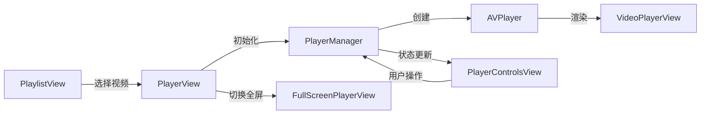

# AI_MediaPlayer 功能文档

> **文档目的**：记录项目当前所有功能点，作为功能迭代的基准文档  
> **最后更新**：2025-11-30

---

## 📋 项目概述

AI_MediaPlayer 是一个基于 SwiftUI 构建的 iOS 视频播放器应用，使用 AVFoundation 框架实现自定义视频播放功能。项目采用 MVVM 架构，具有清晰的代码结构和良好的可扩展性。

---

## ✅ 已实现功能

### 1. 核心播放功能

#### 1.1 视频播放引擎
- [x] 基于 `AVPlayer` 的自定义视频播放器
- [x] 使用 `AVPlayerLayer` 进行视频渲染
- [x] 支持 HLS 流媒体播放
- [x] 支持 MP4 等常见视频格式
- [x] 音频播放支持

#### 1.2 播放控制
- [x] **播放/暂停**：点击按钮切换播放状态
- [x] **进度条控制**：可拖动的视频进度条
- [x] **时间显示**：当前播放时间和总时长（MM:SS 格式）
- [x] **倍速播放**：支持 0.75x、1.0x、1.25x、1.5x、1.75x、2.0x 六档速度
- [x] **精确 Seek**：进度条拖动完成后才执行跳转，避免跳帧
- [x] **快进/快退**：点击按钮快进或快退 10 秒（使用 SF Symbols 的 goforward.10 和 gobackward.10 图标），**支持即时进度更新**
- [x] **音量控制**：支持 0.0 - 1.0 的音量调节，**支持点击图标静音**

#### 1.3 视频显示
- [x] **保持宽高比**：使用 `videoGravity = .resizeAspect`
- [x] **自动黑边**：视频比例不符时自动添加 letterboxing/pillarboxing
- [x] **无裁剪显示**：确保视频内容完整可见
- [x] **全屏支持**：无缝切换到全屏播放模式

### 2. 用户界面

#### 2.1 播放列表界面 (`PlaylistView`)
- [x] 列表展示多个视频
- [x] 显示视频标题和描述
- [x] 点击导航到播放页面
- [x] 内置 4 个示例视频：
  - Big Buck Bunny
  - Elephants Dream
  - Sintel
  - Tears of Steel

#### 2.2 播放器界面 (`PlayerView`)
- [x] 视频渲染区域
- [x] 底部控制栏（半透明背景）
- [x] 导航栏显示视频标题
- [x] 进入时自动播放
- [x] 离开时自动暂停

#### 2.3 全屏播放界面 (`FullScreenPlayerView`)
- [x] 全屏视频显示
- [x] 自定义控制栏
- [x] 右上角关闭按钮

#### 2.4 控制栏组件 (`PlayerControlsView`)
- [x] 播放/暂停按钮（图标动态切换）
- [x] 倍速切换按钮（显示当前倍速）
- [x] 全屏切换按钮
- [x] 可拖动进度条
- [x] 时间显示（当前时间 / 总时长）
- [x] 半透明黑色背景，圆角设计

### 3. 状态管理与响应式

#### 3.1 PlayerManager 状态管理
- [x] 使用 Combine 框架实现响应式更新
- [x] 监听属性：
  - `isPlaying`：播放状态
  - `currentTime`：当前播放时间
  - `duration`：视频总时长
  - `playbackRate`：播放速度
- [x] 自动同步 UI 与播放器状态

#### 3.2 生命周期管理
- [x] 页面出现时自动播放
- [x] 页面消失时自动暂停
- [x] 正确清理 Time Observer，防止内存泄漏
- [x] Combine 订阅自动管理

### 4. 技术实现细节

#### 4.1 视频渲染
- [x] 使用 `UIViewRepresentable` 封装 `AVPlayerLayer`
- [x] 自定义 `PlayerUIView` 处理 layer 布局
- [x] 支持动态更新播放器实例

#### 4.2 进度控制
- [x] 双状态管理（`sliderValue` 和 `isSeeking`）
- [x] 拖动时不受播放器时间更新影响
- [x] Seek 完成回调确保 UI 同步

#### 4.3 倍速播放
- [x] 循环切换 6 档播放速度
- [x] 实时应用到播放中的视频
- [x] 倍速值显示格式化（xx.xxf）

---

## 🏗️ 技术架构

### 技术栈
- **UI 框架**：SwiftUI
- **视频播放**：AVFoundation (AVPlayer, AVPlayerLayer, AVPlayerItem, AVAsset)
- **响应式编程**：Combine
- **数据持久化**：SwiftData (已配置，暂未使用)
- **导航**：NavigationView / NavigationLink

### 架构模式
- **MVVM**：Model-View-ViewModel
  - Model: `PlaylistItem`
  - View: `PlaylistView`, `PlayerView`, `FullScreenPlayerView`, `PlayerControlsView`, `VideoPlayerView`
  - ViewModel: `PlayerManager`

### 项目文件结构
```
AI_MediaPlayer/
├── MediaPlayerApp.swift          # 应用入口
├── PlayerManager.swift           # 播放器管理器（ViewModel）
├── VideoPlayerView.swift         # 视频渲染视图（UIViewRepresentable）
├── PlayerControlsView.swift     # 播放控制 UI
├── FullScreenPlayerView.swift   # 全屏播放视图
├── PlaylistView.swift           # 播放列表界面
├── PlaylistItem.swift           # 播放列表数据模型
├── Item.swift                   # SwiftData 模型（未使用）
└── Assets.xcassets/             # 资源文件
```

---

## 🔧 核心类说明

### PlayerManager
- **职责**：管理 AVPlayer 实例，处理播放逻辑
- **方法**：
  - `play()` - 按当前倍速播放
  - `pause()` - 暂停播放
  - `seek(to:completion:)` - 跳转到指定时间
  - `cyclePlaybackRate()` - 循环切换播放速度
  - `getPlayer()` - 获取 AVPlayer 实例
- **发布属性**：`isPlaying`, `currentTime`, `duration`, `playbackRate`

### VideoPlayerView (UIViewRepresentable)
- **职责**：将 AVPlayerLayer 桥接到 SwiftUI
- **特点**：使用自定义 `PlayerUIView` 管理 layer 生命周期

### PlayerControlsView
- **职责**：播放控制 UI 组件
- **核心状态**：
  - `isSeeking` - 用户是否正在拖动进度条
  - `sliderValue` - 进度条当前值
- **特点**：拖动完成后才执行 seek，避免卡顿

---

## 📊 数据流



---

## 🎯 待开发功能建议

以下功能可在后续版本中考虑实现：

### 播放增强
- [x] 音量控制
- [ ] 亮度控制
- [ ] 手势控制（双击暂停、滑动调节音量/亮度/进度）
- [ ] 画中画（Picture-in-Picture）支持
- [ ] 后台播放

### 播放列表增强
- [ ] 本地视频导入
- [ ] 自定义播放列表创建
- [ ] 播放列表编辑（添加/删除/排序）
- [ ] 播放历史记录
- [ ] 收藏功能

### 媒体格式支持
- [ ] 更多视频格式支持
- [ ] 字幕支持（SRT, VTT）
- [ ] 多音轨切换
- [ ] 视频质量切换

### 用户体验
- [ ] 加载状态指示器
- [ ] 错误处理和提示
- [ ] 网络状态监测
- [ ] 缓冲进度显示
- [ ] 视频封面图
- [ ] 深色/浅色模式适配

### 数据持久化
- [ ] 使用 SwiftData 存储播放列表
- [ ] 记住播放位置
- [ ] 用户偏好设置持久化

### 其他
- [ ] 投屏功能（AirPlay）
- [ ] 视频下载
- [ ] 分享功能
- [ ] 播放统计

---

## 📝 版本历史

### v1.1 - Current (2025-11-30)
- ✅ 快进/快退功能（+10s / -10s），优化了进度更新体验（点击即更新）
- ✅ 音量控制功能（支持静音切换）

### v1.0 (2025-11-29)
- ✅ 基础视频播放功能
- ✅ 自定义播放控制
- ✅ 全屏播放支持
- ✅ 倍速播放
- ✅ 播放列表功能

---

## 📌 注意事项

1. **视频源**：当前使用在线视频源，需要网络连接
2. **错误处理**：当前错误处理较为简单，建议后续完善
3. **性能**：大视频文件可能需要优化内存使用
4. **兼容性**：需要 iOS 17.0+ / macOS 14.0+

---

**文档维护**：每次功能迭代后，请及时更新本文档，将新增功能从"待开发"移至"已实现"，并记录版本历史。
